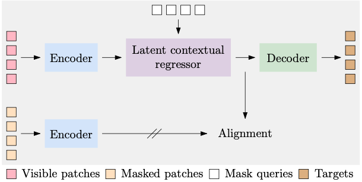

# CAE: Context AutoEncoder for Self-Supervised Representation Learning 

<p align="center">
  
</p>

This is a PyTorch implementation of [CAE: Context AutoEncoder for Self-Supervised Representation Learning](https://arxiv.org/abs/2202.03026).

## Highlights

- State-of-the-art MIM performance. Results in the paper are successfully reproduced.

## Installation

Clone the repo and install required packages.
```bash
pip install -r requirements.txt

# install apex
git clone https://github.com/NVIDIA/apex
cd apex
pip install -v --disable-pip-version-check --no-cache-dir --global-option="--cpp_ext" --global-option="--cuda_ext" ./
```

## Data Preparation
First, download ImageNet-1k from http://image-net.org/.

The directory structure is the standard layout of torchvision's datasets.ImageFolder. The training and validation data are expected to be in the train/ folder and val folder, respectively:

```
/path/to/imagenet/
  train/
    class1/
      img1.jpeg
    class2/
      img2.jpeg
  val/
    class1/
      img3.jpeg
    class/2
      img4.jpeg
```

Second, download the pretrained tokenizer.

```bash
TOKENIZER_PATH=/path/to/save/dall_e_tokenizer_weight
mkdir -p $TOKENIZER_PATH
wget -o $TOKENIZER_PATH/encoder.pkl https://cdn.openai.com/dall-e/encoder.pkl
wget -o $TOKENIZER_PATH/decoder.pkl https://cdn.openai.com/dall-e/decoder.pkl
```


## Pretraining

Here is an example that pretrains CAE-base on ImageNet-1K with 32 GPUs. Please see [scripts/cae_base_800e.sh](scripts/cae_base_800e.sh) for complete script.
```bash
OMP_NUM_THREADS=1 $PYTHON -m torch.distributed.launch \
  --nproc_per_node=8 \
  tools/run_pretraining.py \
  --data_path ${DATA_PATH} \
  --output_dir ${OUTPUT_DIR} \
  --model cae_base_patch16_224_8k_vocab --discrete_vae_weight_path ${TOKENIZER_PATH} \
  --batch_size 64 --lr 1.5e-3 --warmup_epochs 20 --epochs 800 \
  --clip_grad 3.0 --layer_scale_init_value 0.1 \
  --imagenet_default_mean_and_std \
  --color_jitter 0 \
  --drop_path 0.1 \
  --sincos_pos_emb \
  --mask_generator block \
  --num_mask_patches 98 \
  --decoder_layer_scale_init_value 0.1 \
  --no_auto_resume \
  --save_ckpt_freq 100 \
  --exp_name $my_name \
  --regressor_depth 4 \
  --decoder_depth 4 \
  --align_loss_weight 2
```
- `--num_mask_patches`: number of the input patches need be masked. 
- `--batch_size`: batch size per GPU.
- Effective batch size = `number of GPUs` * `--batch_size`. So in the above example, the effective batch size is `64*32 = 2048`.
- `--lr`: learning rate.
- `--warmup_epochs`: learning rate warmup epochs. Warm up [10, 20, 40] epochs for [300, 800, 1600] pretrain epochs respectively.
- `--epochs`: total pretraining epochs.
- `--clip_grad`: clip gradient norm.
- `--drop_path`: stochastic depth rate.
- `--imagenet_default_mean_and_std`: enable this for ImageNet-1k pretraining, i.e., `(0.485, 0.456, 0.406)` for mean and `(0.229, 0.224, 0.225)` for std. For other pretraining data, use `(0.5, 0.5, 0.5)` for mean and `(0.5, 0.5, 0.5)` for std by default.
- `--layer_scale_init_value`: 0.1 for base, 1e-5 for large, set 0 to disable layerscale. We set `--decoder_layer_scale_init_value` the same as this.
- `--sincos_pos_emb`: adopt sin-cos positional embedding during pretraining.
- `--regressor_depth`: length of the regressor.
- `--decoder_depth`: length of the decoder.
- `--align_loss_weight`: weight for alignment loss. 2 by default.

Warmup epochs for 300/800/1600 epochs pretraining are 10/20/40.

For CAE-large, please refer to [scripts/cae_large_1600e.sh](scripts/cae_large_1600e.sh). 


## Results
Here provides the results of CAE-base/CAE-large for these evaluation tasks:
- Linear probing
- Attentive probing
- Fine-tuning
- Semantic segmentation
- Object detection and instance segmentation

Pretrained weights and logs are available ([Google Drive](https://drive.google.com/drive/folders/1wwhg7nj2GQuU9uthVuQLkEEXEjx90G7g?usp=sharing), [Baidu Cloud [Code: 4kil]](https://pan.baidu.com/s/15eZGoI72iLupLrOHqmOM9w)). *: from CAE paper.

| Model      | Pretraining data | #Epoch | Linear | Attentive | Fine-tuning | ADE Seg | COCO Det | COCO InstSeg |
| ---------- | ---------------- | ------ | ------ | --------- | ----------- | ------- | -------- | ------------ |
| MAE-base*  | ImageNet-1K      | 1600   | 67.8   | 74.2      | 83.6        | 48.1    | 48.4     | 42.6         |
| MAE-large* | ImageNet-1K      | 1600   | 76.0   | 78.8      | 86.0        | 53.6    | 54.0     | 47.1         |
| CAE-base   | ImageNet-1K      | 300    | 64.5   | 74.0      | 83.6        | 48.1    | 48.3     | 42.7         |
| CAE-base   | ImageNet-1K      | 800    | 68.9   | 75.9      | 83.8        | 49.7    | 49.9     | 43.9         |
| CAE-base   | ImageNet-1K      | 1600   | 70.3   | 77.2      | 83.9        | 50.3    | 50.3     | 44.2         |
| CAE-large  | ImageNet-1K      | 1600   | 77.8   | 81.2      | 86.2        | 54.9    | 54.5     | 47.5         |


### Linear Probing
- Please refer to [scripts/cae_base_800e.sh](scripts/cae_base_800e.sh) (32 GPUs).  
- For CAE-large, just replace `--model cae_base_patch16_224` with `--model cae_large_patch16_224`.

### Attentive Probing

- Please refer to [scripts/cae_base_800e.sh](scripts/cae_base_800e.sh) (32 GPUs). 
- For CAE-large, just replace `--model cae_base_patch16_224` with `--model cae_large_patch16_224`.

### Fine-tuning
- Please refer to [scripts/cae_base_finetune.sh](scripts/cae_base_finetune.sh) (32 GPUs). 
- For CAE-large, please refer to [scripts/cae_large_finetune.sh](scripts/cae_large_finetune.sh) (32 GPUs).

### Segmentation & Detection
- Please refer to [downstream_tasks](./downstream_tasks) dir to get started.

## Acknowledgement

This repository is built using the [BEiT](https://github.com/microsoft/unilm/edit/master/beit) and [MMSelfSup](https://github.com/open-mmlab/mmselfsup), thanks for their open-source code! Thanks also to the CAE authors for their excellent work!

## Citation
```bibtex
@article{ContextAutoencoder2022,
  title={Context Autoencoder for Self-Supervised Representation Learning},
  author={Chen, Xiaokang and Ding, Mingyu and Wang, Xiaodi and Xin, Ying and Mo, Shentong and Wang, Yunhao and Han, Shumin and Luo, Ping and Zeng, Gang and Wang, Jingdong},
  journal={arXiv preprint arXiv:2202.03026},
  year={2022}
}
```
